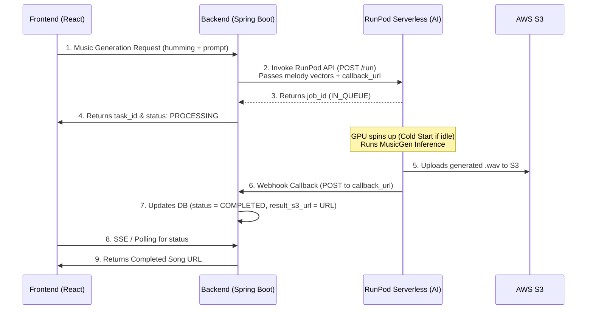

# RunPod Serverless Webhook / Callback Specification

This document details the webhook payload sent by RunPod Serverless (or our AI server wrapper) upon completing an AI music generation job. 

## Webhook Endpoint on Spring Boot Backend

The backend needs to expose a callback endpoint. According to the design specification (DSD), the path is:
*   **Method**: `POST`
*   **URL Path**: `/api/v1/internal/callbacks/generation` (or configured dynamically via `callback_url` request parameter)
*   **Access**: Internal/Public (ensure appropriate firewall/IP filtering if necessary, or secure with an internal API token)

---

## Payload Formats

Since we have two ways of integrating (RunPod's native Webhook vs. manual callback from our AI script), the backend should ideally support or adapt to one of the following formats.

### Option A: RunPod Native Webhook Payload (Recommended for Pure Serverless)
When RunPod Serverless finishes a job, it POSTs its native payload format to the backend webhook URL:

```json
{
  "id": "runpod-job-id-123456",
  "status": "COMPLETED",
  "delayTime": 2450,
  "executionTime": 8200,
  "output": {
    "status": "COMPLETED",
    "generated_audio_url": "https://humix-s3-bucket.s3.ap-northeast-2.amazonaws.com/generated/songs/runpod-job-id-123456.wav"
  }
}
```

#### Mapping Logic on Backend:
1.  Locate the `MusicGeneration` record using `id` (maps to `task_id`).
2.  Check if `status` is `"COMPLETED"`.
3.  Extract the generated audio file path from `output.generated_audio_url`.
4.  Update the database record status to `COMPLETED` and store the audio URL in `result_s3_url`.

---

### Option B: Custom Callback Payload (Matches DSD Specification Page 37)
If using the manual callback trigger inside our `handler.py` script, it will POST this payload directly to your `callback_url`:

```json
{
  "generated_audio_url": "https://humix-s3-bucket.s3.ap-northeast-2.amazonaws.com/generated/songs/runpod-job-id-123456.wav"
}
```

*Note: Since the callback request doesn't natively contain the `task_id` in the root JSON block of Option B, the filename in `generated_audio_url` (e.g., `runpod-job-id-123456.wav`) or URL query parameters can be used to extract the corresponding task ID, OR the backend can look up the ID from the URL path if the webhook URL was generated dynamically (e.g., `/api/v1/internal/callbacks/generation?task_id=12345`).*

---

## Request Flow Diagram


