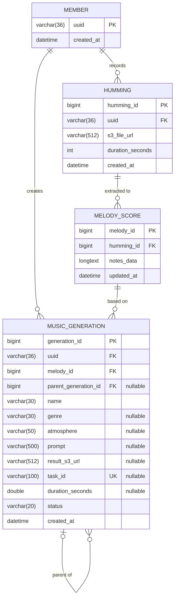

# HuMix DB ERD

JPA 엔티티(`src/main/java/com/humix/api/domain/*/entity`) 기준 스키마입니다.
스키마를 바꾸는 PR에서는 이 문서도 함께 갱신합니다.

## 테이블 설명

### member
게스트 사용자. 기기 고유 UUID(`device_id`)를 PK로 사용합니다.

| 컬럼 | 설명 |
|---|---|
| uuid | 기기 고유 식별자 (PK, 36자) |
| created_at | 가입 시각 |

### humming
사용자가 업로드한 허밍 오디오 메타데이터.

| 컬럼 | 설명 |
|---|---|
| humming_id | PK |
| uuid | 소유자 (`member.uuid`) |
| s3_file_url | S3에 업로드된 오디오 URL |
| duration_seconds | 허밍 길이 (초) |
| created_at | 저장 시각 |

### melody_score
허밍에서 추출한 멜로디 벡터(악보). 웹 에디터에서 수정되면 `notes_data`가 갱신됩니다.

| 컬럼 | 설명 |
|---|---|
| melody_id | PK |
| humming_id | 원본 허밍 (`humming.humming_id`) |
| notes_data | 노트 배열 JSON 문자열 (`pitch`, `onset_seconds`, `duration_seconds`) |
| updated_at | 마지막 수정 시각 |

### music_generation
AI 음악 생성 결과. 수정(재생성)하면 원본을 바꾸지 않고 `parent_generation_id`가 원본을 가리키는 새 행이 추가됩니다.

| 컬럼 | 설명 |
|---|---|
| generation_id | PK |
| uuid | 생성한 사용자 (`member.uuid`) |
| melody_id | 생성에 사용한 멜로디 (`melody_score.melody_id`) |
| parent_generation_id | 수정 원본 (`music_generation.generation_id`). 최초 생성이면 NULL |
| name | 곡 제목 (기본값 "나의 허밍곡") |
| genre | 장르 |
| atmosphere | 분위기 (API의 `mood`) |
| prompt | 사용자가 입력한 스타일 프롬프트 (선택, 최대 500자). 재생성 시 재사용 |
| result_s3_url | 생성된 오디오 S3 URL. 완료 전에는 NULL |
| task_id | 비동기 작업 ID (유니크) |
| duration_seconds | 곡 길이 (초). 요청 시에는 요청한 길이, AI 완료 콜백 이후에는 AI가 보고한 실제 길이 |
| status | `PROCESSING` / `COMPLETED` / `FAILED` / `CANCELED` |
| created_at | 요청 시각 |
